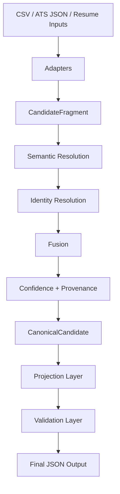

# Semantic Guided Candidate Transformer

Deterministic, ontology-driven pipeline that turns heterogeneous candidate data (resumes, ATS exports, recruiter CSVs) into a canonical profile and projects it into assignment-facing JSON — with full confidence scoring, provenance tracking, and validation.

---

## Quick Start

```bash
# 1. Create and activate a virtual environment
python -m venv .venv
source .venv/Scripts/activate    # Windows
# source .venv/bin/activate      # macOS / Linux

# 2. Install dependencies
pip install -r requirements.txt

# 3. Download spaCy model (required for resume parsing)
python -m spacy download en_core_web_sm

# 4. Launch the web dashboard
python -m uvicorn ui.app:app --host 127.0.0.1 --port 8080
```

Open **http://127.0.0.1:8080** in your browser.

Upload any combination of resume (PDF/DOCX), ATS JSON, or recruiter CSV, then click **Run Pipeline**. The dashboard shows summary stats, a pipeline stage visualisation, a candidate profile, and six analysis tabs (Canonical JSON, Projected Output, Confidence, Provenance, Validation, Logs).

---

## CLI Usage

```bash
python main.py --ats sample_inputs/candidate_ats.json \
               --csv sample_inputs/candidate_recruiter.csv \
               --output outputs/candidate.json
```

| Flag | Purpose |
|------|---------|
| `--csv` | CSV source file (repeatable) |
| `--ats` | ATS JSON source file (repeatable) |
| `--resume` | Resume PDF or DOCX (repeatable) |
| `--config` / `--projection` | Optional projection config (YAML/JSON) |
| `--output` | Destination JSON file (required) |

---

## Run Tests

```bash
python tests/run_all_tests.py
# or
python -m pytest tests/ -q
```

37 tests covering adapters, fusion, semantic resolution, projection, validation, models, and the CLI.

---

## Architecture

```
Adapters → Fragments → Semantic Resolution → Identity Resolution
→ Fusion → Confidence + Provenance → Projection → Validation → Output
```

| Stage | What it does |
|-------|--------------|
| **Adapters** | Convert raw inputs (CSV, ATS JSON, PDF, DOCX) into `CandidateFragment` objects |
| **Semantic Resolution** | Normalize entities against curated ontologies (skills, companies, job titles, degrees, countries) |
| **Identity Resolution** | Cluster fragments that belong to the same person |
| **Fusion** | Merge evidence deterministically across sources |
| **Confidence** | Compute per-field trust scores from source reliability, cross-source agreement, extraction quality, semantic certainty, and conflict penalties |
| **Provenance** | Record where every canonical value came from — auditable and explainable |
| **Projection** | Convert canonical model into assignment-facing output schema (configurable) |
| **Validation** | Check projected JSON and report issues without crashing |



---

## Folder Structure

```
.
├── main.py                    # CLI entry point
├── requirements.txt
├── sample_inputs/             # Resume PDF, ATS JSON, recruiter CSV fixtures
├── sample_outputs/            # Generated output examples
├── src/                       # Pipeline backend
│   ├── adapters/              # Source adapters (CSV, ATS, PDF, DOCX)
│   ├── confidence/            # Deterministic confidence scoring
│   ├── config/                # YAML configuration (semantic, fusion, projection, etc.)
│   ├── core/                  # Pipeline orchestrator, settings, logging
│   ├── fusion/                # Candidate fusion & identity resolution
│   ├── interfaces/            # Abstract base classes
│   ├── models/                # Pydantic domain models
│   ├── ontology/              # Curated ontologies (+ YAML data files)
│   ├── projection/            # Projection engine & config loader
│   ├── provenance/            # Provenance tracking engine
│   ├── semantic/              # Semantic resolution engine
│   ├── transformation/        # Transformation engines
│   ├── utils/                 # Extractors, hashing, normalizers, ID generation
│   └── validation/            # Validation engine
├── tests/                     # Test suite (37 tests)
└── ui/                        # Visualization layer (presentation only)
    ├── app.py                 # FastAPI application factory
    ├── routes.py              # Routes: GET / (landing), POST /run (pipeline)
    ├── templates/
    │   ├── base.html          # Base layout (navbar, footer)
    │   ├── index.html         # Landing page with upload form
    │   └── results.html       # Results dashboard with 6 tabs
    └── static/
        ├── css/styles.css     # Corporate dashboard theme
        └── js/app.js          # Copy, collapse, toast, tab persistence
```

---

## Configuration

Runtime behaviour is controlled by YAML files in `src/config/`:

| File | Purpose |
|------|---------|
| `semantic.yml` | Ontology paths and matching thresholds |
| `fusion.yml` | Merge and conflict resolution policy |
| `confidence.yml` | Scoring weights, category weights, caps |
| `projection.yml` | Default output schema mapping |
| `source_reliability.yml` | Per-source and per-field trust settings |

---

## Design Philosophy

- **Deterministic** — same inputs always produce the same output
- **Canonical-first** — normalize internally before projecting externally
- **Provenance everywhere** — every value is traceable to its source
- **Configurable projection** — output schema is independent of internal model
- **Validation as reporting** — checks inform, never crash

---

## Known Limitations

- Resume ingestion supports PDF and DOCX only (no plain-text or image-based resumes)
- Purely deterministic — no free-form LLM generation for semantic decisions
- Tuned for single-candidate / small-batch processing, not large-scale distributed ingestion
- Validation reports issues rather than stopping the pipeline

## Future Work

- OCR support for scanned resumes
- Expanded ontology domains and aliases
- Richer validation diagnostics
- Additional projection configuration examples
