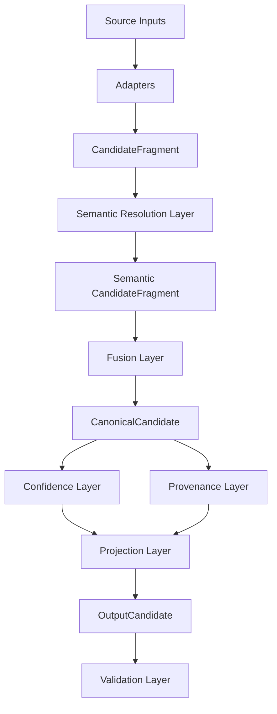

# Semantic Guided Candidate Transformer (SGCT)

## Project Overview

Semantic Guided Candidate Transformer (SGCT) is a deterministic, production-oriented multi-source candidate data transformation system. This repository currently contains **Implementation Phase 1: Project Foundation**.

Phase 1 provides:
- Complete domain model contracts with Pydantic v2.
- Runtime enums and type-safe schema definitions.
- Abstract interface layer for adapters, semantics, fusion, projection, validation, confidence, and provenance.
- Foundation infrastructure for settings, logging, exceptions, and pipeline context.
- Runtime configuration files aligned with finalized architecture.
- Rich ontology datasets for skills, companies, job titles, degrees, and countries.

This phase intentionally excludes all business logic, extraction, semantic resolution logic, fusion logic, projection logic, validation logic, and pipeline orchestration logic.

## Architecture Diagram



## Folder Structure

```text
candidate-transformer/
├── README.md
├── requirements.txt
├── pyproject.toml
├── .gitignore
├── .env.example
├── main.py
├── src/
│   ├── core/
│   ├── models/
│   ├── adapters/
│   ├── semantic/
│   ├── fusion/
│   ├── projection/
│   ├── validation/
│   ├── confidence/
│   ├── provenance/
│   ├── ontology/
│   ├── config/
│   ├── utils/
│   └── interfaces/
├── tests/
├── sample_inputs/
├── sample_outputs/
└── logs/
```

## Technology Stack

- Python 3.12
- Pydantic v2
- PyYAML
- RapidFuzz
- phonenumbers
- dateparser
- pdfplumber
- python-docx
- spaCy
- typing_extensions

## Project Philosophy

SGCT follows a deterministic and explainable architecture:
- Canonical internal model is immutable after fusion.
- Projection is the only output-shaping layer.
- Unknown values are preserved rather than fabricated.
- Provenance and confidence are first-class internal contracts.
- Semantic intelligence is ontology-driven and deterministic.

## Implementation Phases

1. **Phase 1: Project Foundation (Current)**
   - Domain models, enums, interfaces, infra, config, ontology, documentation, test skeleton.
2. **Phase 2: Source Adapters and Extractor Stubs**
3. **Phase 3: Semantic Resolution and Ontology Registry Logic**
4. **Phase 4: Entity Fusion and Confidence/Provenance Engines**
5. **Phase 5: Projection, Validation, and End-to-End Pipeline Wiring**
