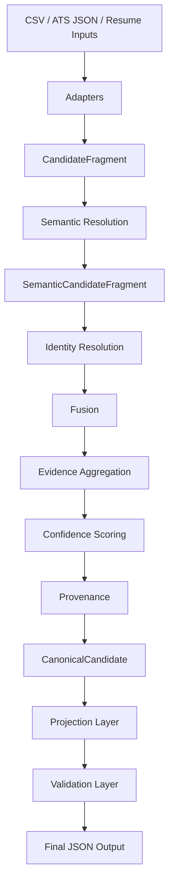

# Semantic Guided Candidate Transformer

Semantic Guided Candidate Transformer (SGCT) is a deterministic, ontology-driven pipeline that turns heterogeneous candidate data into a canonical profile and then projects that profile into an assignment-facing JSON output.

The repository is submission-ready and includes the full pipeline, projection and validation layers, CLI entry point, sample inputs, sample outputs, and a complete test suite.

## Project Overview

SGCT ingests candidate data from CSV and ATS JSON sources, and resumes in PDF or DOCX format. The pipeline resolves semantic meaning against ontologies, merges repeated candidate evidence deterministically, assigns confidence, records provenance, projects the canonical candidate into a configurable output schema, and validates the final JSON.

The design goal is simple: produce stable output that is explainable, reproducible, and easy to review.

## Architecture

SGCT is organized as a layered pipeline:

1. Source adapters convert raw inputs into `CandidateFragment` objects.
2. Semantic resolution normalizes entities using ontology-backed rules.
3. Identity resolution clusters fragments that belong to the same person.
4. Fusion and evidence aggregation combine all canonical evidence.
5. Confidence scoring computes deterministic trust scores.
6. Provenance tracking preserves where every canonical value came from.
7. Projection converts the canonical model into the assignment output schema.
8. Validation checks the projected JSON and reports issues without crashing.

## Pipeline Diagram



## Folder Structure

```text
candidate-transformer/
├── README.md
├── Design Decisions.md
├── EdgeCases.md
├── Stage 1 One Page Design Document.md
├── Demo Script.md
├── main.py
├── pyproject.toml
├── requirements.txt
├── sample_inputs/
├── sample_outputs/
├── src/
│   ├── adapters/
│   ├── confidence/
│   ├── config/
│   ├── core/
│   ├── fusion/
│   ├── interfaces/
│   ├── models/
│   ├── ontology/
│   ├── projection/
│   ├── provenance/
│   ├── semantic/
│   ├── transformation/
│   ├── utils/
│   └── validation/
└── tests/
```

## Design Philosophy

SGCT follows five rules:

- Deterministic output over probabilistic guessing.
- Canonical internal models over ad hoc transformations.
- Explicit provenance over hidden data loss.
- Configurable projection over hard-coded output shapes.
- Validation as a reporting step, not a crash path.

## Semantic Resolution

Semantic resolution maps raw candidate text into canonical ontology values. The engine uses curated ontologies for skills, companies, job titles, degrees, and countries, with deterministic fallback behavior for unknown values.

This stage is what lets `Python3`, `python`, and `Python` converge into one canonical skill, or `United States` and `US` converge into one country code.

## Ontology Usage

Ontologies live under `src/ontology/` and are loaded at runtime through configuration. They provide:

- canonical names
- alias mappings
- category and parent relationships
- deterministic fuzzy lookup support

Ontology lookups are used before any merge or projection logic so the rest of the pipeline operates on normalized values.

## Confidence

Confidence is computed from weighted evidence, source reliability, extraction quality, semantic certainty, and conflict penalties. The confidence layer never invents trust; it combines deterministic signals from the pipeline.

The projected output includes confidence when enabled by projection configuration.

## Provenance

Provenance records preserve the path from raw input to canonical output. Each important field can be traced back to the source record, transformation rule, and resolution method that produced it.

This makes the output auditable and easy to explain during review.

## Configuration

Runtime behavior is controlled by YAML files in `src/config/`:

- `semantic.yml` for ontology and matching behavior
- `fusion.yml` for merge and conflict policy
- `confidence.yml` for scoring weights and thresholds
- `projection.yml` for output schema mapping
- `source_reliability.yml` for source trust settings

## Projection Layer

Projection converts `CanonicalCandidate` into the final JSON format.

The default projection keeps the assignment schema intact. A custom projection config can remap fields, rename paths, normalize values, and decide how missing data should be handled.

## CLI Usage

The CLI entry point is [`main.py`](main.py).

Supported inputs:

- `--csv` for CSV source files
- `--ats` for ATS JSON source files
- `--resume` for PDF or DOCX resume files
- `--config` for a custom projection config
- `--output` for the destination JSON file

Example:

```bash
python main.py --csv sample_inputs/candidate.csv --output outputs/candidate.json
```

## Running Tests

Run the full repository test suite with:

```bash
python tests/run_all_tests.py
```

## Sample Commands

```bash
python main.py --csv sample_inputs/candidate.csv --output outputs/candidate_from_csv.json
python main.py --ats sample_inputs/candidate.json --output outputs/candidate_from_ats.json
python main.py --csv sample_inputs/candidate.csv --ats sample_inputs/candidate.json --output outputs/merged_candidate.json
python tests/run_all_tests.py
```

## Sample Outputs

The repository includes sample fragment fixtures in `sample_outputs/`:

- `sample_outputs/candidate_fragment_from_csv.json`
- `sample_outputs/candidate_fragment_from_json.json`

The repository also includes representative projected outputs generated from the shipped fixtures:

- `sample_outputs/projected_candidate_from_csv.json`
- `sample_outputs/projected_candidate_from_ats.json`

The CLI writes canonical projected JSON to the output path you choose. A typical result includes fields such as `candidate_id`, `full_name`, `emails`, `phones`, `location`, `skills`, `experience`, `education`, `provenance`, and `overall_confidence` when enabled. Some optional fields may remain empty when the source fixture does not provide enough evidence.

## Known Limitations

- Resume ingestion supports PDF and DOCX, not plain text resume files.
- The system is deterministic by design, so it does not use free-form LLM generation for semantic decisions.
- Validation reports issues instead of stopping the pipeline.
- The repository is tuned for assignment submission, not for large-scale distributed ingestion.

## Future Work

- Add OCR support for scanned resumes.
- Expand the ontology set with more domains and aliases.
- Expose the pipeline through an API service.
- Add richer validation diagnostics and reporting.
- Add more end-to-end sample outputs for additional projection configurations.